<h1 align="center">📄 Document Signature App</h1>

## About the Project

The Document Signature Workflow System is a full-stack web application designed to digitize and automate document approval and signing processes. It enables secure uploading of PDF documents, assignment of multiple signers in a defined sequence, and digital signing through an intuitive drag-and-drop interface.

The system enforces a structured sequential signing workflow, ensuring that documents are signed in a predefined order while maintaining full traceability of actions through audit logging.

This application is built to simulate real-world enterprise document workflow systems and demonstrates how modern organizations can eliminate manual paperwork by implementing secure digital approval mechanisms.

The system ensures:

• Only authenticated users can access the platform

• Only assigned signers can sign a document

• Signing strictly happens in predefined order

• Users cannot sign twice

• Users cannot skip signing sequence

• Signed documents cannot be altered after completion

• All actions are recorded in audit logs

These controls prevent:

•	Unauthorized access

•	Out-of-order approvals

•	Data tampering

•	Workflow manipulation

\_\_\_\_\_\_\_\_\_\_\_\_\_\_\_\_\_\_\_\_\_\_\_\_\_\_\_\_\_\_\_\_\_\_\_\_\_\_\_\_

## Project Summary

The Document Signature Workflow System is a full-stack web application designed to streamline digital document approvals through a secure, structured, and automated signing process.

This application enables users to manage the complete lifecycle of a document — from upload to final signature — while enforcing workflow rules, maintaining security controls, and ensuring full audit traceability.

This application allows users to:

•	Upload PDF documents

•	Assign multiple signers in a defined sequence

•	Drag and drop signature placement on document preview

•	Track document status

•	View audit history

•	Download signed documents

The system enforces:

•	Sequential signing workflow

•	Secure authentication

•	Role-based access validation

•	Backend PDF manipulation using image embedding

It combines:

Frontend (React)

Backend (Spring Boot)

Database (PostgreSQL)

PDF Processing (Apache PDFBox)

\_\_\_\_\_\_\_\_\_\_\_\_\_\_\_\_\_\_\_\_\_\_\_\_\_\_\_\_\_\_\_\_\_\_\_\_\_\_\_\_

## Introduction

In modern digital environments, organizations increasingly rely on automated systems to manage document approvals and signatures. As businesses shift toward remote operations and distributed teams, the need for secure, paperless, and trackable document workflows has become critical.

Organizations require:

• Paperless document signing

• Remote approvals from multiple stakeholders

• Real-time document tracking

• Audit logging for compliance

• Multi-party authorization with controlled workflow

Traditional signing methods —

• Slow and time-consuming

• Dependent on manual coordination

• Prone to human error

• Difficult to monitor or audit

• Inefficient for remote teams

These limitations create delays in business operations, increase administrative overhead, and reduce transparency in approval processes.It demonstrates real-world enterprise workflow implementation using scalable architecture.The motivation behind this project is to design and implement a secure digital system that replicates structured enterprise-level approval workflows while eliminating the inefficiencies of manual document handling.

This project addresses these issues by implementing:

• Digital PDF embedding of signatures

• Sequential multi-signer workflow enforcement

• Real-time document status tracking

• Secure JWT-based authentication

• Backend validation to prevent unauthorized actions

• Complete audit logging for traceability

\_\_\_\_\_\_\_\_\_\_\_\_\_\_\_\_\_\_\_\_\_\_\_\_\_\_\_\_\_\_\_\_\_\_\_\_\_\_\_\_

## Tech Stack

## 🔹 Frontend

•	React.js

•	React Router

•	Axios

•	React-PDF

•	Custom Styled UI (Modern Dark Theme)

The frontend layer is responsible for delivering an interactive, responsive, and user-friendly experience. It is built using modern JavaScript frameworks and follows a component-based architecture.

The frontend handles:

•	Rendering dynamic document lists

•	Managing authentication tokens

•	Displaying document previews

•	Handling drag-and-drop signature placement

•	Managing real-time state updates

•	Filtering and searching documents

•	Displaying workflow status indicators

## 🔹 Backend

•	Spring Boot

•	Spring Security (JWT Authentication)

•	Spring Data JPA

•	Apache PDFBox

•	REST APIs

The backend serves as the core engine of the application. It is responsible for enforcing business rules, maintaining workflow integrity, securing endpoints, and managing PDF processing.

The backend performs:

•	Authentication \& authorization

•	Workflow validation

•	Status transitions

•	Database transactions

•	PDF manipulation

•	Audit logging

•	File system management

## 🔹 Database

•	PostgreSQL

The database layer provides persistent storage and ensures relational integrity between entities.It maintains structured data for:

•	Users

•	Documents

•	Document Signers

•	Audit Logs

### Design Principles:

•	Normalized relational schema

•	Foreign key relationships

•	Transaction-safe operations

•	Status-based workflow tracking

•	Timestamp-based auditing

### Relationship Overview:

•	One User → Many Documents

•	One Document → Many Signers

•	One Document → Many Audit Logs

### The database ensures:

•	Data consistency

•	Workflow synchronization

•	Accurate state transitions

•	Historical record maintenance

Each signing action updates multiple tables within a transaction to ensure atomicity and reliability.

### PostgreSQL ensures:

•	ACID compliance

•	Data integrity

•	Reliable concurrency handling

•	Scalable relational modeling

## 🔹 File Handling

•	Local File System Storage

•	Base64 Image Conversion for Signature

The file handling subsystem manages PDF storage and signature embedding.

### Storage Strategy:

•	Original PDFs stored in local file system

•	File path saved in database

•	Updated PDF overwrites original file after signing

•	No temporary signature files stored separately

### Signature Processing Flow:

1\.	User creates signature (text-based)

2\.	Frontend converts signature into canvas image

3\.	Canvas converted to Base64 string

4\.	Base64 sent to backend

5\.	Backend decodes into byte array

6\.	PDFBox embeds image into PDF

7\.	File saved permanently

### Memory \& Performance Handling:

•	Object URL cleanup prevents memory leaks

•	Percentage-based coordinate system ensures scaling compatibility

•	File stored locally for fast read/write operations

\_\_\_\_\_\_\_\_\_\_\_\_\_\_\_\_\_\_\_\_\_\_\_\_\_\_\_\_\_\_\_\_\_\_\_\_\_\_\_\_

## Use Cases

### 1️ Use Case: User Authentication (Login)

This use case allows a registered user to securely access the system using valid credentials.

The system verifies the email and password against stored records in the database.

Upon successful authentication, a JWT token is generated and returned to the user.

The token is used to authorize all future API requests.

This ensures secure, stateless session management across the application.

### 2️ Use Case: Upload Document

This use case enables an authenticated user to upload a PDF document to the system.

The user assigns one or more signers in a predefined sequential order.

The system stores the file on the server and saves metadata in the database.

The first signer is marked as PENDING while others are marked as WAITING.

An audit entry is created to record the upload action.

### 3️ Use Case: Assign Multi-Signer Workflow

This use case defines the structured signing order for a document.

Each signer is assigned a signing sequence number.

The system ensures that only one signer is active at a time.

Signers cannot skip order or sign out of sequence.

This guarantees controlled and traceable approval progression.

### 4️ Use Case: Sign Document

This use case allows the active signer to digitally sign a document.

The signer previews the PDF and places their signature using drag-and-drop.

The signature is converted into an image and sent to the backend.

The backend embeds the signature permanently into the PDF file.

After signing, the workflow automatically progresses to the next signer.

### 5️ Use Case: View Documents

This use case allows users to view documents they uploaded or are assigned to sign.

The system retrieves documents associated with the logged-in user.

Users can filter documents by status (All, Pending, Signed).

Search functionality allows filtering by filename.

The page provides options to preview, sign, or delete documents.

### 6️ Use Case: View Audit History

This use case displays the complete activity timeline of a document.

The system records every major action such as upload, signing, and download.

Each audit record includes the user, action, and timestamp.

The audit log ensures transparency and accountability.

Users can track the full lifecycle of the document.

### 7️ Use Case: Download Signed Document

This use case allows authorized users to download the signed PDF document.

The system validates access before allowing download.

The file sent includes permanently embedded signatures.

A download action is recorded in the audit log.

This ensures both accessibility and traceability of document distribution.

### 8️ Use Case: Delete Document

This use case enables the document owner to delete a document.

The system verifies ownership before allowing deletion.

The PDF file is removed from server storage.

Related database records are deleted safely within a transaction.

An audit entry is created to record the deletion action.

### 9️ Use Case: Enforce Sequential Signing

This system-level use case ensures workflow integrity.

Only the signer with PENDING status can sign the document.

After signing, the next signer automatically becomes active.

If all signers complete signing, the document status changes to SIGNED.

This mechanism prevents unauthorized or out-of-order signing.

\_\_\_\_\_\_\_\_\_\_\_\_\_\_\_\_\_\_\_\_\_\_\_\_\_\_\_\_\_\_\_\_\_\_\_\_\_\_\_\_

## Features with Screenshots

## ✅ Register (User Registration)

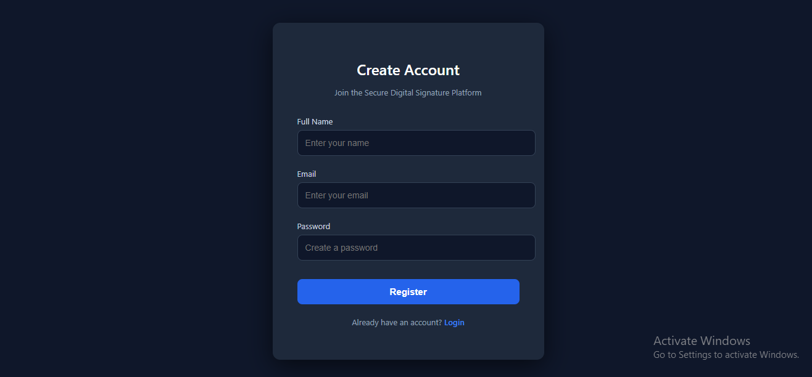

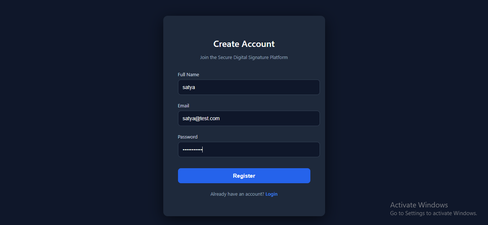

### 🔎 Description

The Register feature allows new users to create an account in the system. This is the first step before accessing any protected functionality.

Registration ensures that only verified users can participate in document workflows and maintain accountability for all actions performed in the system.

### ⚙ Feature Functionality

User enters required details such as name, email, and password.

The system validates input fields (non-empty, valid email format).

Password is securely encrypted before being stored in the database.

The user record is created in the database with default role permissions.

After successful registration, the user can proceed to login.

## ✅ Login (User Authentication)

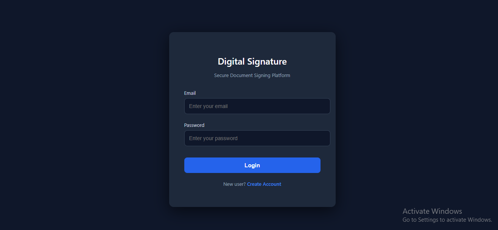

&nbsp;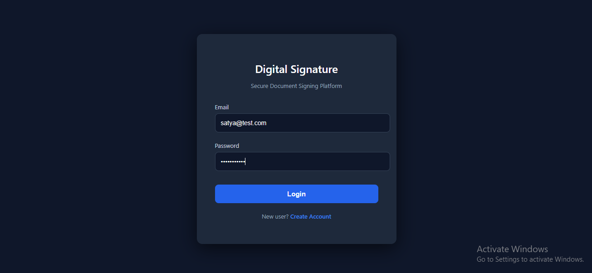

### 🔎 Description

The Login feature allows registered users to authenticate themselves and gain access to the application.

Login ensures secure system access, prevents unauthorized operations, and protects document workflows from external misuse.

### ⚙ Feature Functionality

User enters email and password.

Backend verifies credentials against stored user data.

If credentials are valid, a JWT (JSON Web Token) is generated.

The token is returned to the frontend and stored locally.

All subsequent API requests include the token for authorization.

### 🔐 Authentication Flow

User submits login credentials.

Server validates credentials.

JWT token generated.

Token stored on client side.

Token sent in Authorization header for all secure requests.

\_\_\_\_\_\_\_\_\_\_\_\_\_\_\_\_\_\_\_\_\_\_\_\_\_\_\_\_\_\_\_\_\_\_\_\_\_\_\_\_

## 📊 Dashboard Page

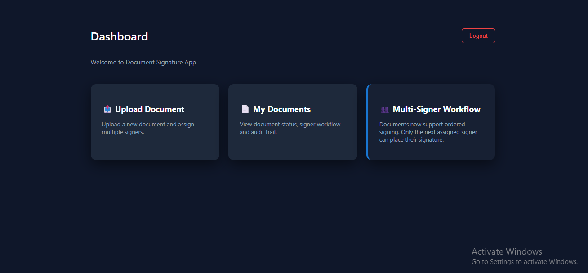

### 🔎 Overview

The Dashboard serves as the central navigation hub of the Document Signature Workflow System.

It provides users with quick access to core features such as uploading documents, managing documents, and understanding the multi-signer workflow.

The dashboard is designed to:

Provide quick navigation to key features

Simplify user workflow access

Present system capabilities clearly

Improve usability through visual cards

Offer secure logout functionality

\_\_\_\_\_\_\_\_\_\_\_\_\_\_\_\_\_\_\_\_\_\_\_\_\_\_\_\_\_\_\_\_\_\_\_\_\_\_\_\_

## 📄 Upload Document Page

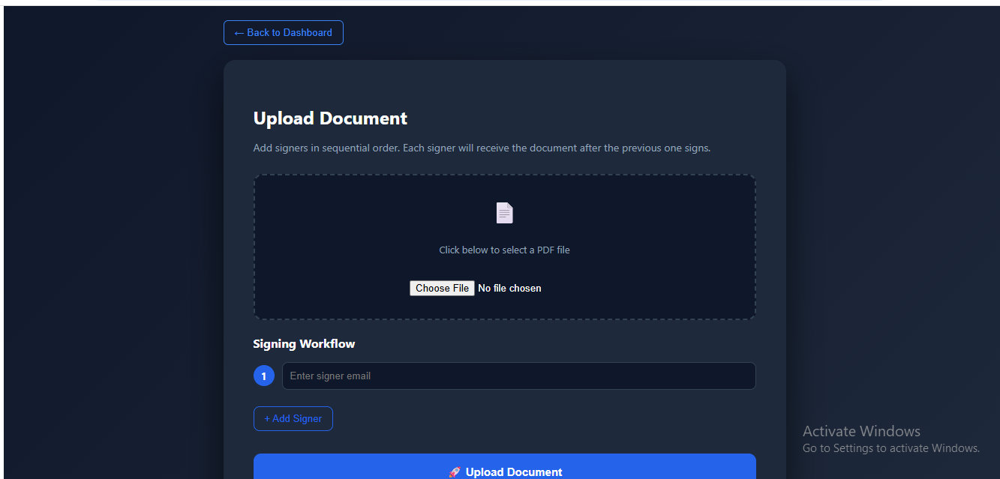 

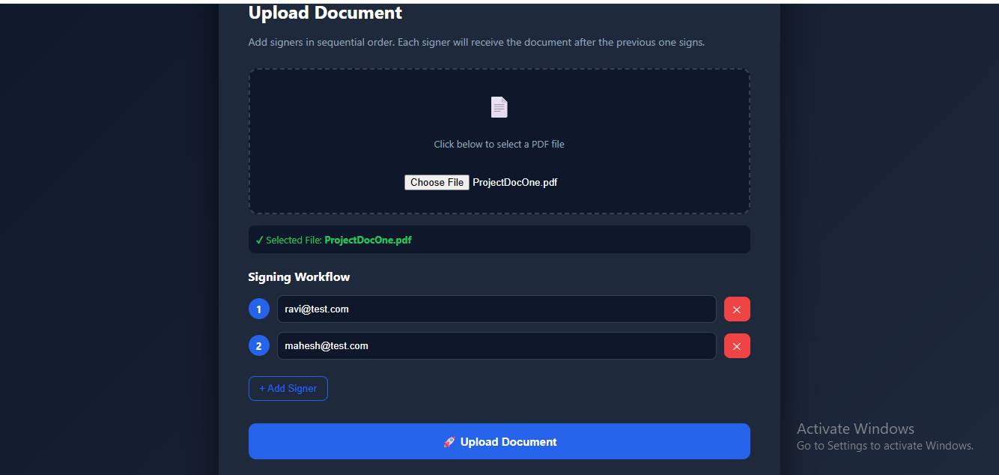 

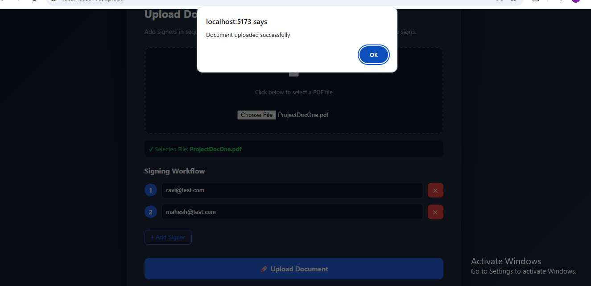

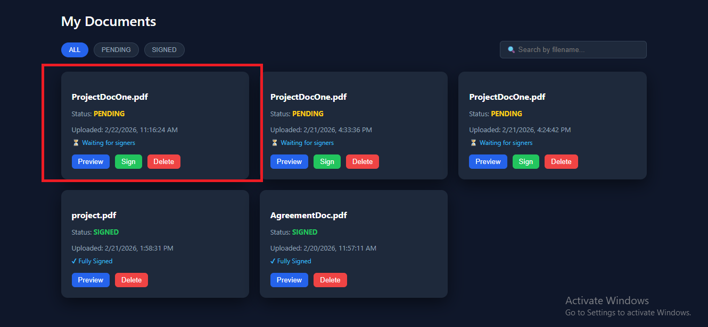

### 🔎 Overview

his screen allows the user to upload a PDF document and define the signing workflow.

At the top, the “Back to Dashboard” button enables easy navigation to the main page.

The central upload section allows users to select a PDF file from their system. Only PDF files are supported to ensure proper digital signing functionality.

Below the upload section, the Signing Workflow area allows the user to enter signer email addresses in sequential order. The step number (1, 2, 3, etc.) indicates the order in which signers must sign the document.

The “+ Add Signer” button allows users to dynamically add more signers, enabling multi-party approvals. Once everything is configured, clicking “Upload Document” sends the file and signer details to the backend to initialize the signing workflow

This page serves as the starting point of the document lifecycle in the system.

The Upload Page is designed to:

•	Accept PDF documents for digital signing

•	Define the order of signers

•	Initialize the document workflow

•	Store document metadata securely

•	Trigger audit logging for upload activity

\_\_\_\_\_\_\_\_\_\_\_\_\_\_\_\_\_\_\_\_\_\_\_\_\_\_\_\_\_\_\_\_\_\_\_\_\_\_\_\_

## 📂 My Documents Page

### 🔎 Overview

The My Documents page displays all documents associated with the logged-in user.

It acts as the document management center of the application, allowing users to monitor document status, perform actions, and track workflow progress.

This page provides filtering, searching, previewing, signing, and deletion capabilities.

The My Documents page allows users to:

•	View uploaded documents

•	Check signing status

•	Filter documents by status

•	Search by filename

•	Preview documents

•	Sign pending documents

•	Delete owned documents

### 📌 Status Filter Buttons (ALL)

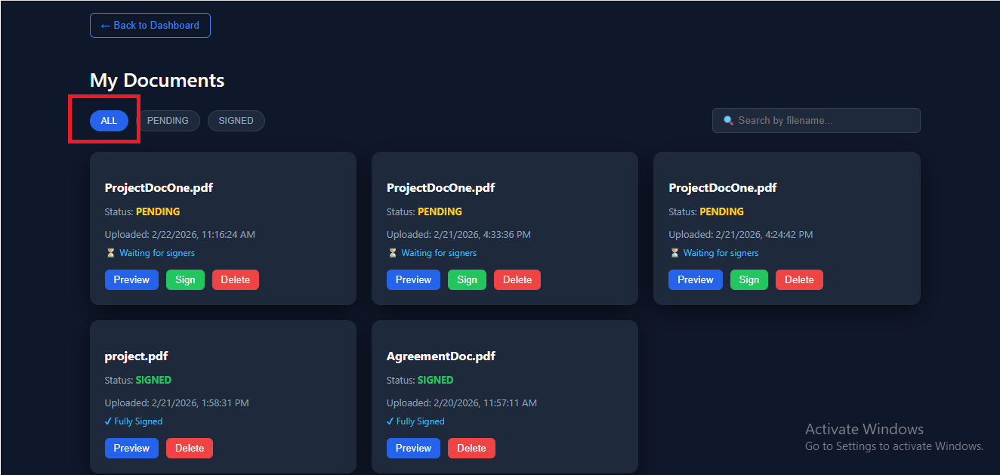

Functionality

Displays all documents associated with the logged-in user.

Includes both pending and fully signed documents.

Provides a complete overview of the user’s document history.

### 📌 Status Filter Buttons (PENDING)

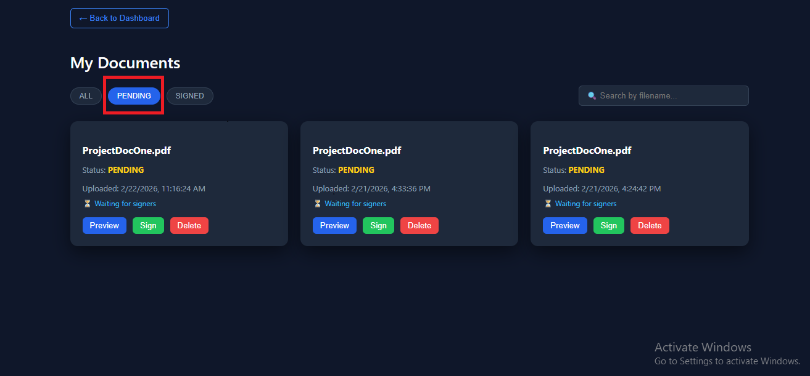

Functionality

Shows documents that are still awaiting signatures.

Includes documents where signing is in progress or not yet completed.

Helps users quickly identify documents that require action.

### 📌 Status Filter Buttons (SIGNED)

Functionality

Displays documents that have been fully signed by all assigned signers.

Indicates that the signing workflow has been successfully completed.

Allows users to preview or download finalized documents.

\_\_\_\_\_\_\_\_\_\_\_\_\_\_\_\_\_\_\_\_\_\_\_\_\_\_\_\_\_\_\_\_\_\_\_\_\_\_\_\_

## 🚪 Logout Button

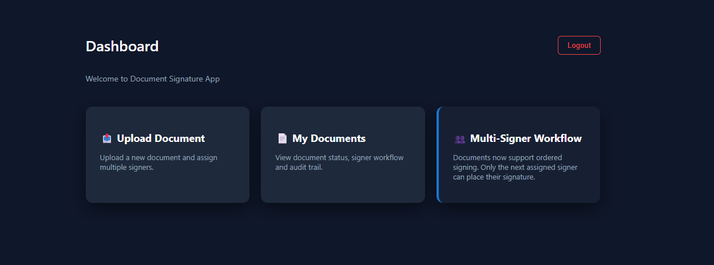

Allows users to securely exit the system.

## 📄 Document Preview Page

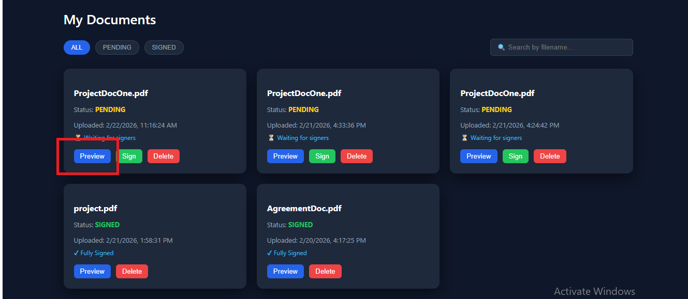 

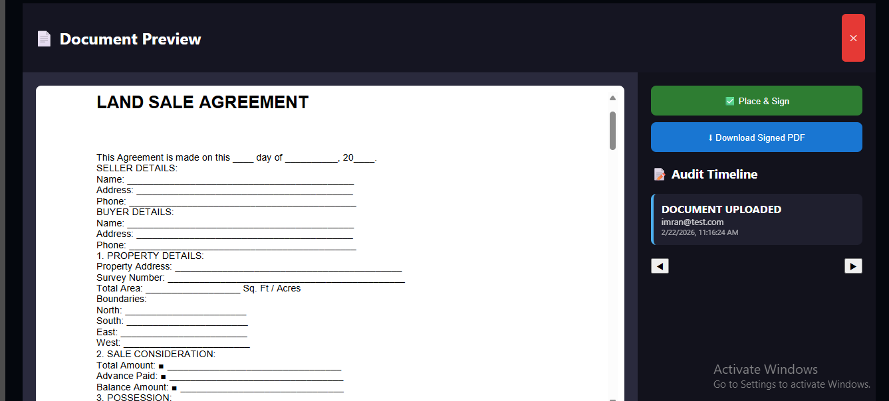

### 🔎 Overview

The Document Preview page allows users to view the selected PDF document and perform signing actions.

It provides a real-time preview of the document along with workflow controls and audit tracking.

This page plays a critical role in the signing stage of the document lifecycle.

The Preview Page is designed to:

•	Display the uploaded PDF document

•	Allow drag-and-drop signature placement

•	Enable document signing

•	Provide document download functionality

•	Show audit history in real time

## ✍ Place \& Sign Button

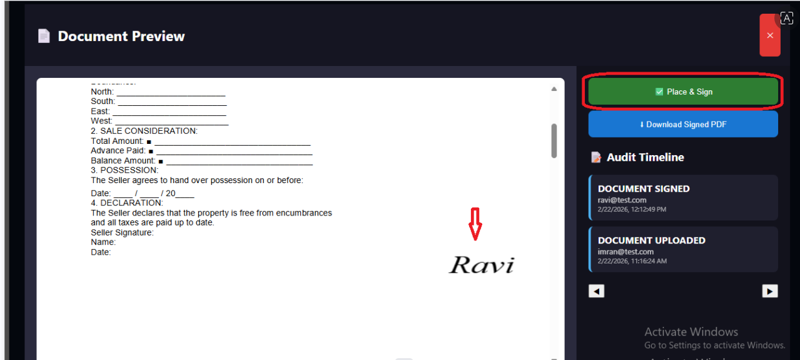

Allows the assigned signer to confirm and embed their signature.

## 📥 Download Signed PDF Button

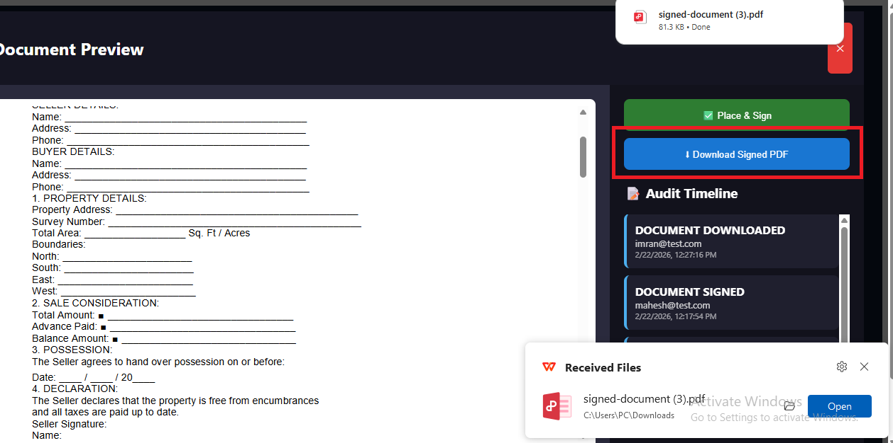 

Allows users to download the signed document.

## 🕵 Audit Timeline Panel

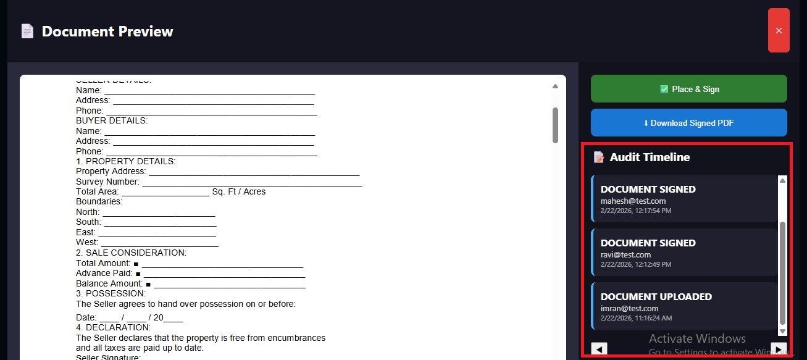

Displays document activity history including upload, sign, and download events.

## ✍️ Sign Button \& Signature Pad Feature

🔘 Sign Button

Allows eligible signers to initiate the digital signing process.

## 🖊 Signature Pad

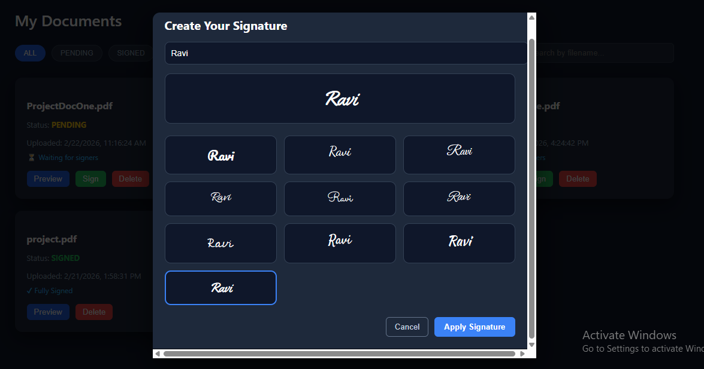

Allows users to create a digital signature using styled text.

## 🖱 Sign Document (Drag \& Drop Signature)

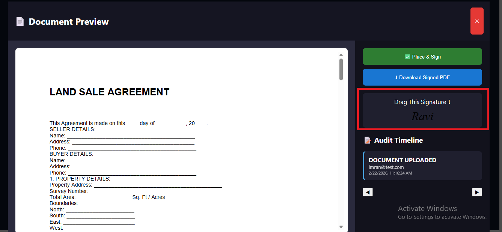
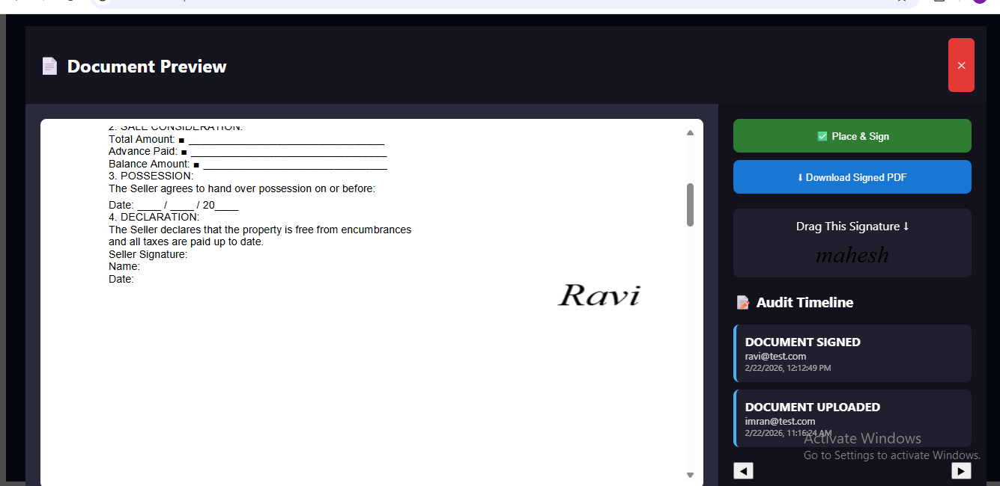
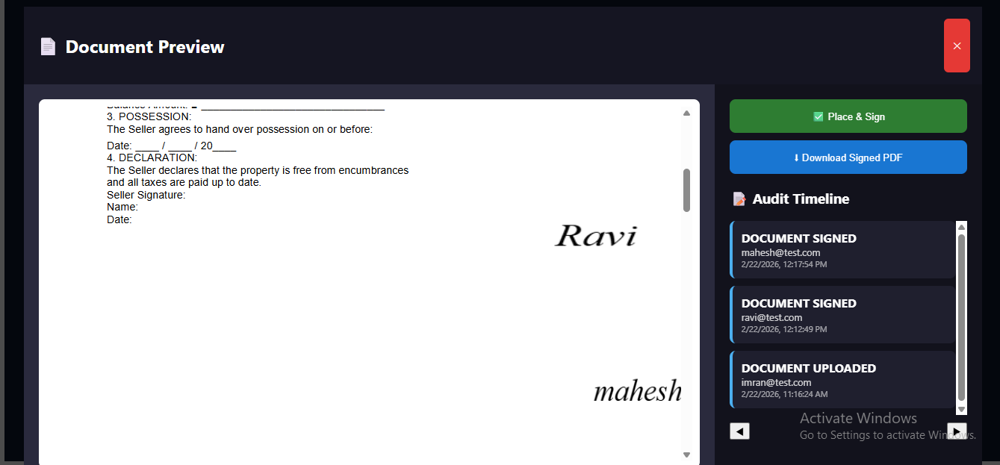

Allows the assigned signer to digitally sign the document using drag-and-drop placement.

## 🗑 Delete Document

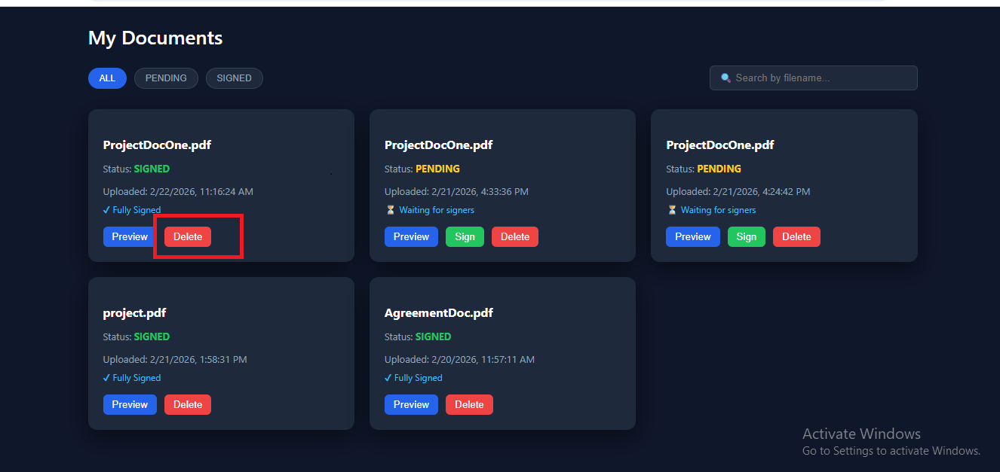 

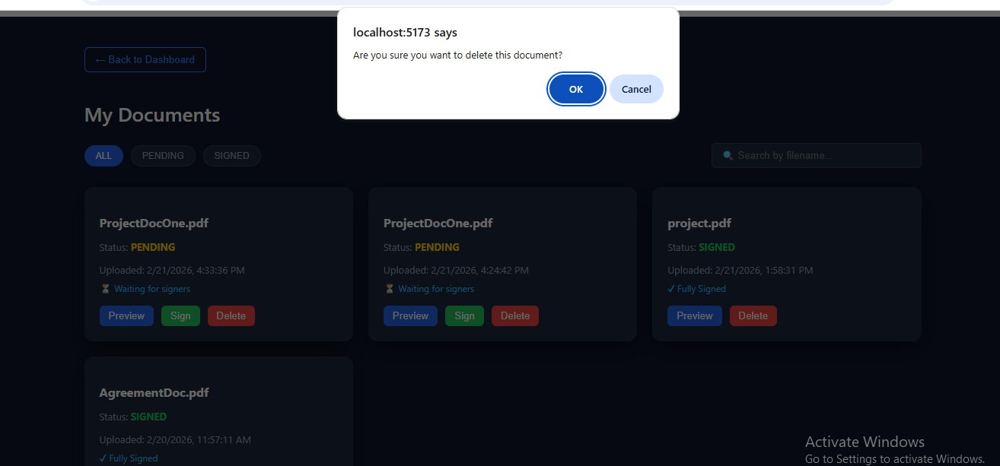

&nbsp;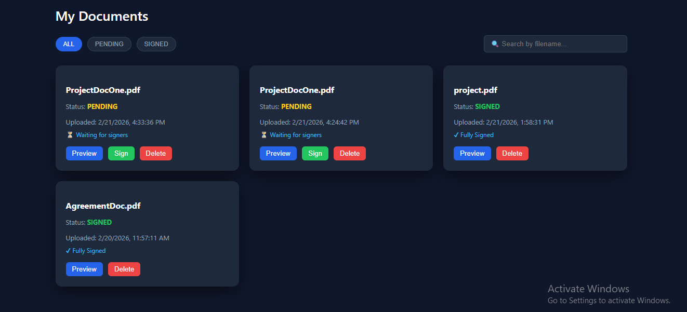

Allows document owner to permanently delete a document.

\_\_\_\_\_\_\_\_\_\_\_\_\_\_\_\_\_\_\_\_\_\_\_\_\_\_\_\_\_\_\_\_\_\_\_\_\_\_\_\_

## 📄 Status Lifecycle

### 🔄 Document Status Transition

PENDING → SIGNED

## Before Signature (PENDING)

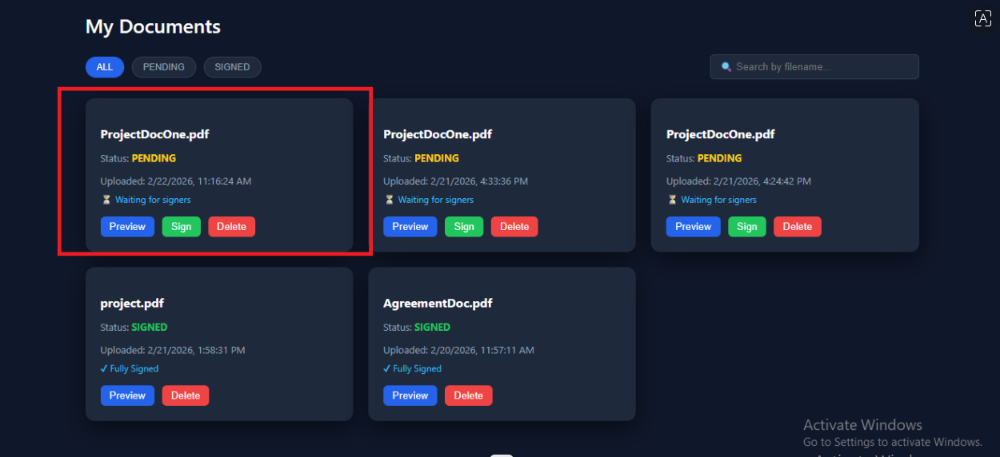

## After Signature (SIGNED)

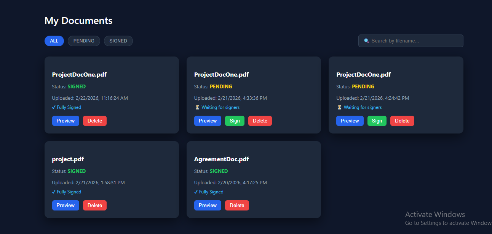

The document initially remains in PENDING status after upload, indicating that signatures are still required.

During this stage, assigned signers complete their signatures in the defined sequence.

The system continuously checks whether all required signers have signed the document.

\_\_\_\_\_\_\_\_\_\_\_\_\_\_\_\_\_\_\_\_\_\_\_\_\_\_\_\_\_\_\_\_\_\_\_\_\_\_\_\_

## Database Design

## 1\. Introduction

The Document Signature Workflow System uses a relational database to manage users, documents, multi-signer workflows, and audit tracking.

The database is designed to ensure structured document lifecycle management, sequential signing enforcement, and complete traceability of actions.

The system uses PostgreSQL as the primary database management system.

The database schema follows normalized relational design principles to maintain data integrity, consistency, and scalability.

## 2\. Core Tables

### 2.1 Users Table

The Users table stores all registered users who can upload documents or participate in signing workflows.

### Key Attributes

•	id – Primary Key

•	name – User’s full name

•	email – Unique identifier for login

•	password – Encrypted password

•	created\_at – Registration timestamp

### Functional Role

•	Manages authentication and authorization

•	Identifies document uploader

•	Identifies assigned signers

•	Links user identity to audit logs

### Constraints

•	Email must be unique

•	Password stored using secure hashing

•	Primary key ensures unique user identity

### 2.2 Documents Table

The Documents table stores metadata about uploaded PDF files and tracks their lifecycle status.

### Key Attributes

•	id – Primary Key

•	file\_name – Name of uploaded file

•	file\_type – MIME type (PDF)

•	file\_path – Server storage path

•	status – Document state (PENDING / SIGNED)

•	uploaded\_by – Foreign Key referencing Users

•	uploaded\_at – Upload timestamp

•	signed\_at – Final signing timestamp

### Functional Role

•	Maintains document lifecycle

•	Links document to uploader

•	Tracks overall signing completion

•	Controls document-level status transitions

## Status Lifecycle

### PENDING → SIGNED

###  2.3 Document\_Signers Table

The Document\_Signers table manages the sequential multi-signer workflow.

### Key Attributes

•	id – Primary Key

•	document\_id – Foreign Key referencing Documents

•	signer\_email – Assigned signer

•	signing\_order – Defines signing sequence

•	status – WAITING / PENDING / SIGNED

•	signed\_at – Timestamp of signature

### Functional Role

•	Enforces signing order

•	Activates only one signer at a time

•	Prevents out-of-order signing

•	Tracks individual signer completion

### Workflow Control Logic

•	First signer → PENDING

•	Remaining signers → WAITING

•	After signing → Next signer becomes PENDING

•	When all signers complete → Document marked SIGNED

This table forms the core workflow control mechanism.

###  2.4 Audit\_Logs Table

The Audit\_Logs table records all significant document-related activities.

### Key Attributes

•	id – Primary Key

•	document\_id – Foreign Key referencing Documents

•	action – Type of activity (UPLOAD / SIGN / DOWNLOAD / DELETE)

•	performed\_by – User who performed action

•	performed\_at – Timestamp

### Functional Role

•	Maintains document activity history

•	Ensures accountability

•	Supports audit timeline display

•	Enables traceability for compliance

## 3\. Relationship Overview

### 3.1 User → Uploads → Document

One user can upload multiple documents.

Each document belongs to exactly one uploader.

Relationship Type: One-to-Many

Users (1) → Documents (Many)

### 3.2 Document → Has → Multiple Signers

Each document can have multiple assigned signers.

Each signer entry belongs to one document.

Relationship Type: One-to-Many

Documents (1) → Document\_Signers (Many)

### 3.3 Document → Has → Audit Logs

Each document generates multiple audit log entries.

Each audit entry corresponds to one document.

Relationship Type: One-to-Many

Documents (1) → Audit\_Logs (Many)

## 4\. Transaction Management

All critical operations are executed within database transactions to ensure consistency.

### Examples:

• Uploading a document creates entries in Documents, Document\_Signers, and Audit\_Logs

• Signing updates Document\_Signers and possibly Documents, and inserts Audit\_Logs

• Deleting removes file and related database entries safely

This ensures atomicity and prevents partial updates.

## 5\. Data Integrity \& Constraints

### The database enforces:

•	Primary key constraints

•	Foreign key relationships

•	Unique email constraint

•	Status-based workflow control

•	Transaction safety

### These mechanisms ensure:

•	Referential integrity

•	Accurate workflow progression

•	Secure user identification

•	Reliable document state management

\_\_\_\_\_\_\_\_\_\_\_\_\_\_\_\_\_\_\_\_\_\_\_\_\_\_\_\_\_\_\_\_\_\_\_\_\_\_\_\_

## Future Enhancements

•	Email notification system

•	Public signing links

•	Token-based signing URLs

•	Document expiration

•	Cloud storage integration

•	Signature drawing pad

•	Admin dashboard

•	Role-based management

The Document SignatureSystem can be further enhanced with additional enterprise-level capabilities.

An email notification system can be implemented to automatically inform signers when it is their turn to sign.

Public signing links can allow external users to sign documents without full registration.

Token-based signing URLs can be introduced to ensure secure, time-limited access.

Document expiration functionality can prevent documents from remaining pending indefinitely.

Cloud storage integration (such as AWS S3) can improve scalability and reliability.

A signature drawing pad can enable users to create handwritten digital signatures.

An admin dashboard can provide centralized monitoring and control over users and documents.

Role-based access management can introduce structured permission control.

Multi-page signing support can allow signatures to be placed on different pages.

Real-time status notifications can improve workflow transparency.

Document versioning can help track changes and maintain historical records.

Bulk document upload functionality can improve operational efficiency.

Advanced reporting and analytics can provide insights into document activity.

These enhancements can transform the system into a full-scale enterprise digital signature platform.

\_\_\_\_\_\_\_\_\_\_\_\_\_\_\_\_\_\_\_\_\_\_\_\_\_\_\_\_\_\_\_\_\_\_\_\_\_\_\_\_

## Conclusion

The Digital Document Signature Workflow System successfully demonstrates a complete end-to-end full-stack application architecture.

It integrates complex multi-user sequential workflow logic to enforce structured document approvals.

Secure authentication and authorization mechanisms ensure controlled access and data protection.

The system provides real-time document lifecycle tracking from upload to final signature completion.

Backend PDF manipulation using Apache PDFBox enables permanent signature embedding.

The modern, responsive UI enhances usability and user experience.

A well-designed relational database ensures integrity and workflow consistency.

Enterprise-style audit logging guarantees accountability and traceability of actions.

The project effectively simulates real-world digital signing workflows used in business environments.

Overall, it showcases strong backend engineering combined with intuitive frontend implementation, reflecting practical software development expertise

This project showcases strong backend logic implementation combined with intuitive frontend design.

It simulates real-world business workflows found in enterprise-level eSignature platforms and demonstrates practical software engineering principles.

\_\_\_\_\_\_\_\_\_\_\_\_\_\_\_\_\_\_\_\_\_\_\_\_\_\_\_\_\_\_\_\_\_\_\_\_\_\_\_\_

